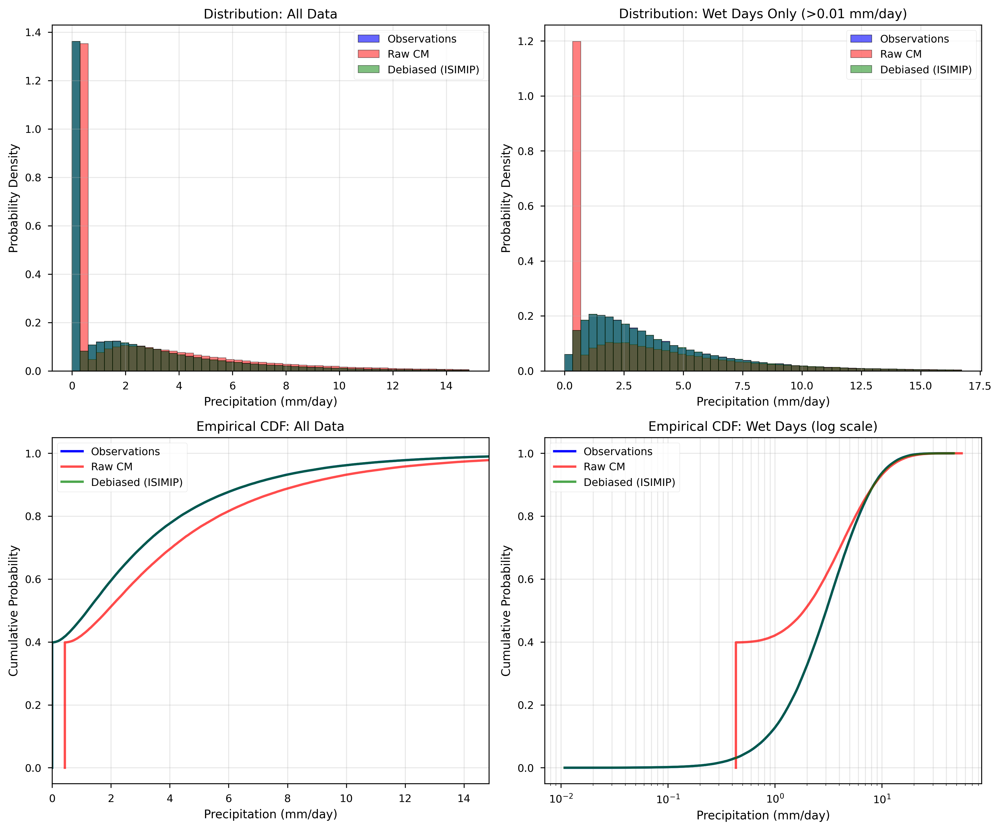
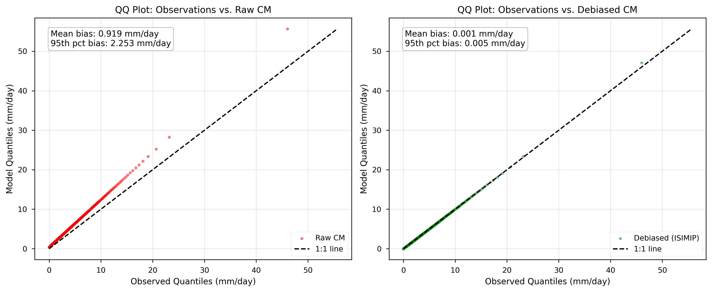
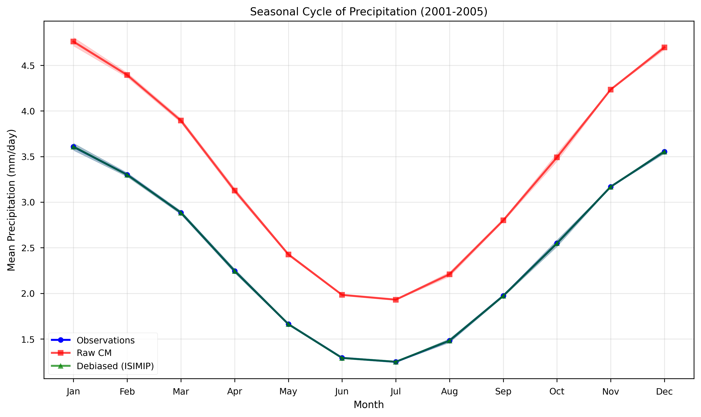
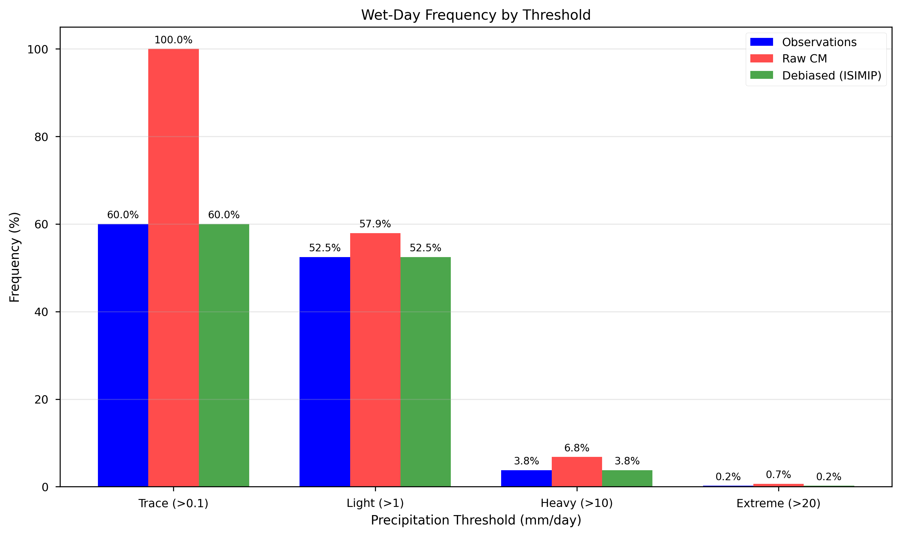
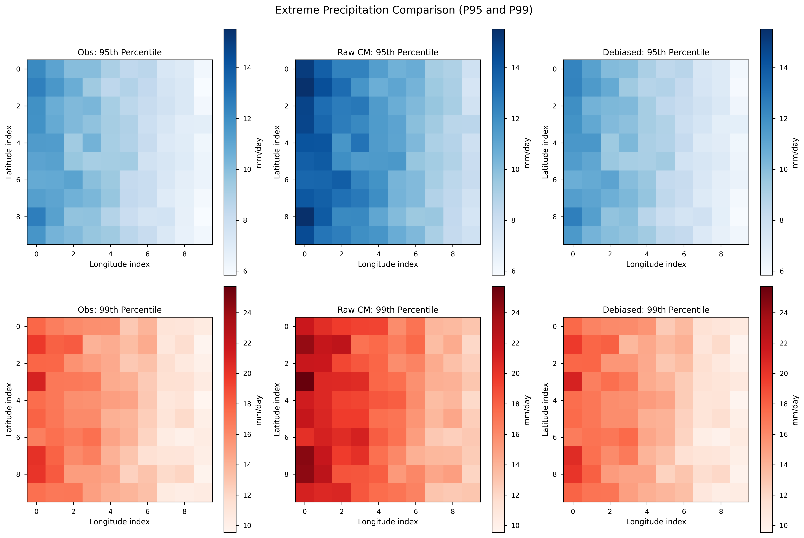
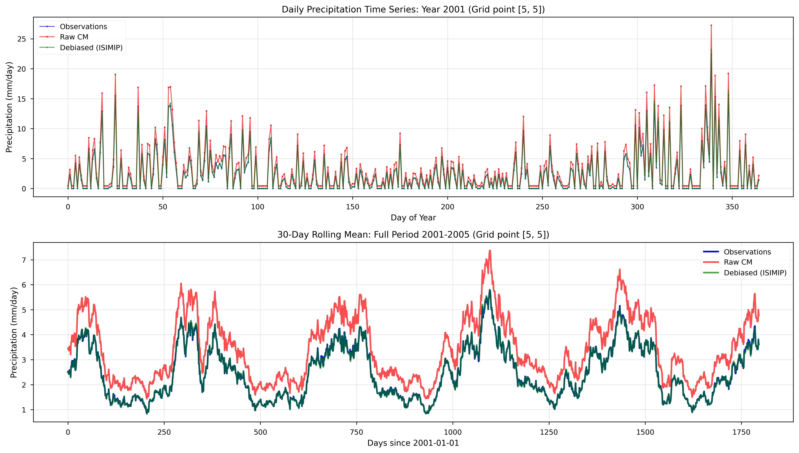
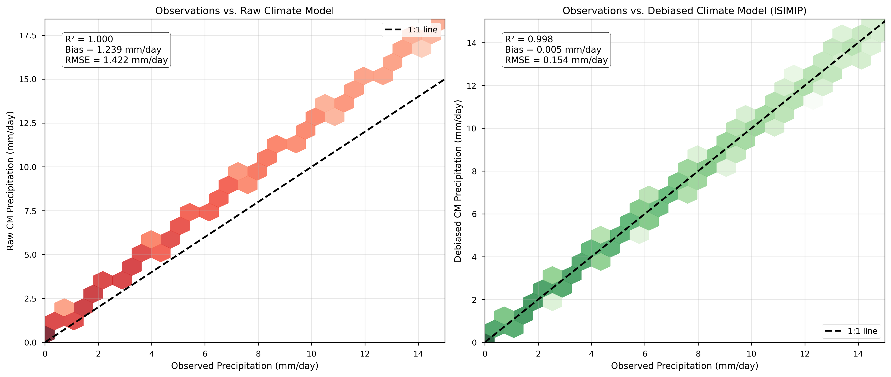
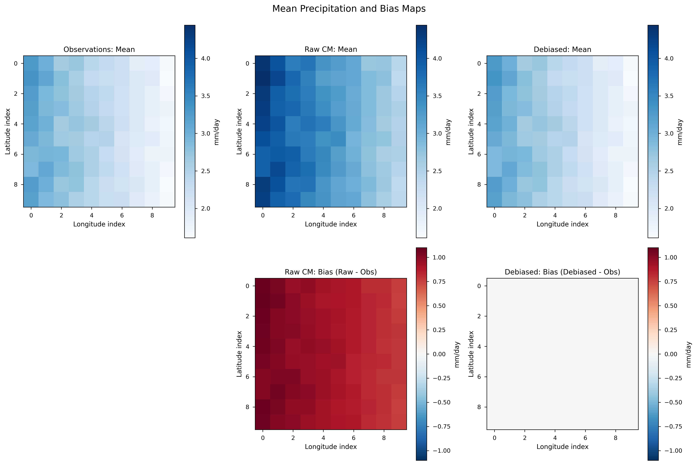

# Bias Correction Diagnostic Figures

Generated: 2025-10-01

## Overview

This directory contains comprehensive diagnostic plots for evaluating bias correction
performance using the **ISIMIP method** from the ibicus package.

**Dataset**: Precipitation (pr) validation period 2001-2005

**Method**: ISIMIP (Lange 2021) - trend-preserving parametric quantile mapping

**References**:
- ibicus repository: [https://github.com/ecmwf-projects/ibicus](https://github.com/ecmwf-projects/ibicus)
- Documentation: [https://ibicus.readthedocs.io/en/latest/](https://ibicus.readthedocs.io/en/latest/)
- Paper: Spuler et al. 2024, Geoscientific Model Development, doi:[10.5194/gmd-17-1249-2024](https://doi.org/10.5194/gmd-17-1249-2024)

## Diagnostic Figures

### 1. Histograms and Empirical Cumulative Distribution Functions

**File**: `01_histograms_and_ecdfs.png`

Comparison of probability distributions for all data and wet days only. ECDFs show how well the bias correction matches the observed distribution.

---

### 2. Quantile-Quantile (QQ) Plots

**File**: `02_qq_plots.png`

QQ plots comparing observed vs. raw and observed vs. debiased quantiles. Points on the 1:1 line indicate perfect agreement.

---

### 3. Seasonal Cycle of Precipitation

**File**: `03_seasonal_cycle.png`

Monthly mean precipitation climatology (2001-2005) showing seasonal patterns. Shaded areas represent standard error across years.

---

### 4. Wet-Day Frequency by Threshold

**File**: `04_wet_day_frequency.png`

Frequency of days exceeding different precipitation thresholds. Critical for assessing bias correction of precipitation occurrence.

---

### 5. Extreme Precipitation (P95 and P99)

**File**: `05_extreme_percentiles_maps.png`

Spatial distribution of 95th and 99th percentile precipitation. Extreme values are often challenging for climate models.

---

### 6. Time Series at Representative Point

**File**: `06_timeseries_sample_point.png`

Daily precipitation and 30-day rolling mean for a central grid point. Illustrates temporal variability and bias correction smoothness.

---

### 7. Scatter Plots: Observed vs. Modeled

**File**: `07_scatter_comparison.png`

Hexbin scatter plots with 1:1 reference line. Includes R², bias, and RMSE statistics. Log-scaled color shows density of points.

---

### 8. Spatial Bias Maps

**File**: `08_spatial_bias_maps.png`

Mean precipitation and absolute bias (model - observations) maps. Shows spatial structure of biases before and after correction.

---

## Interpretation Guidelines

### Key Metrics for Success:

1. **Distribution Alignment** (Histograms/ECDFs): Debiased distribution should closely match observations
2. **QQ Plots**: Points should cluster near the 1:1 line across all quantiles
3. **Seasonal Cycle**: Debiased monthly means should track observations
4. **Wet-Day Frequency**: Critical for precipitation - frequencies should match observations
5. **Extremes**: P95/P99 should be corrected without introducing artifacts
6. **Temporal Coherence**: Time series should maintain realistic variability
7. **Spatial Patterns**: Bias maps should show reduced systematic errors

### Known Limitations:

- Bias correction cannot add information not present in observations
- Assumes stationarity of bias between training and application periods
- Spatial correlation structure may be imperfectly preserved
- Extreme events beyond observed range are extrapolated

## Methods Summary

### ISIMIP (Hempel et al. 2013, Lange 2019, 2021)

- **Type**: Parametric quantile mapping with trend preservation
- **Distribution**: Precipitation modeled with left-censored Gamma
- **Temporal**: Running 31-day window for seasonal variation
- **Extremes**: Additive correction for highest quantiles
- **Trend**: Explicitly preserves climate change signal

### Why CDFt Failed

The CDF-transform (CDFt) method encountered "Quantiles must be in the range [0, 1]" errors,
likely due to:
- Extreme values or numerical precision issues in ECDF estimation
- Insufficient handling of zero-inflated precipitation data
- Edge cases in the time-evolving quantile mapping

## Next Steps

1. Apply ISIMIP to full future projection period (e.g., 2006-2100)
2. Evaluate additional metrics (spell lengths, spatial correlation, multivariate dependencies)
3. Document any remaining biases for downstream impact modeling
4. Consider ensemble of methods if uncertainty quantification is needed

---

*Generated with `plot_bias_correction_diagnostics.py`*
